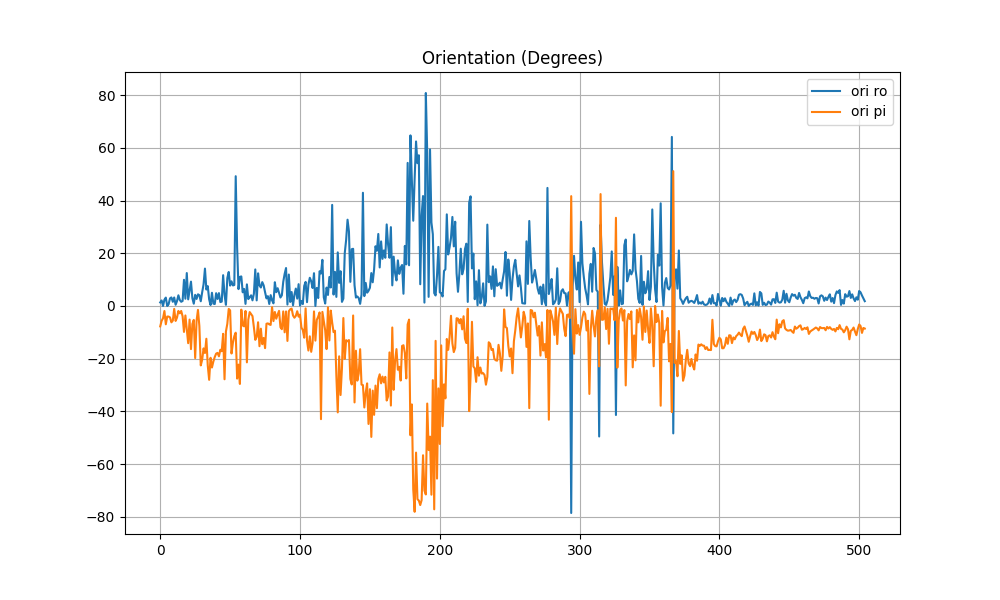
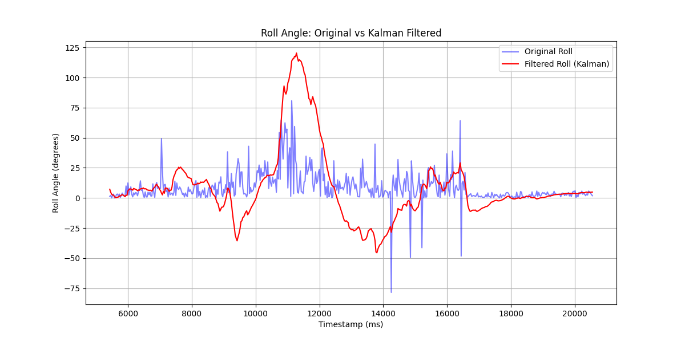
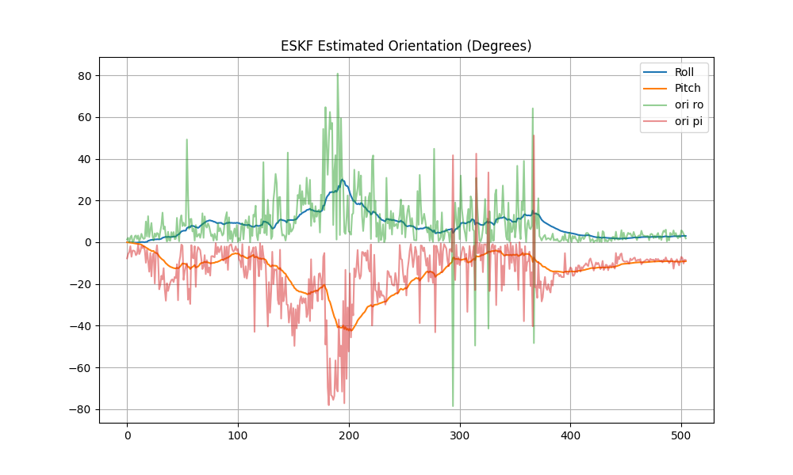
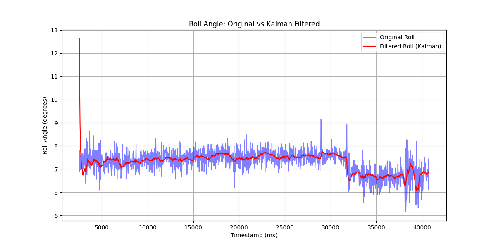
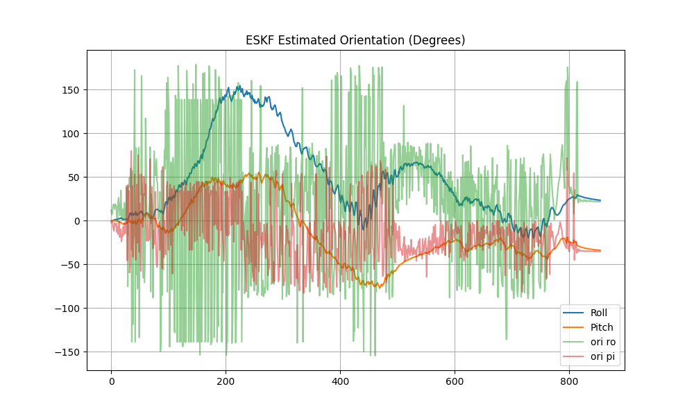
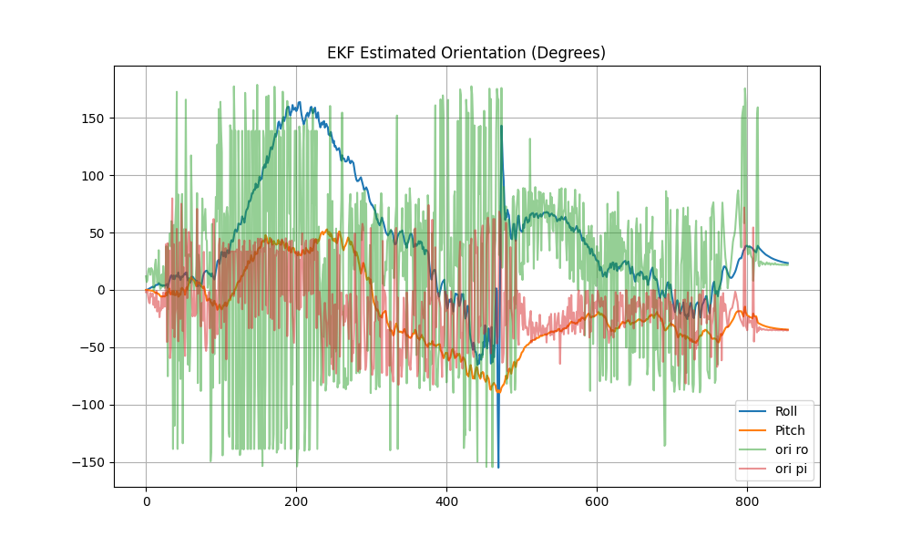

> 本文着重讲述卡尔曼滤波器家族的三大代表:线性卡尔曼滤波器, 扩展卡尔曼滤波器和状态误差卡尔曼滤波器. 立志要用最简单的话说明白, 让大学一年级的同学都能听懂.

## 技术背景
我们的世界充满噪声. 当测量我们感兴趣物体的一些参数的时候, 总有误差存在. 比如说陀螺仪的测量角度按照纯粹观测值来看, 充满了高频率的跳跃. 根据中心极限定理, 我们认为我们的测量量被各种不同分布的大量微小扰动干扰, 噪声可以看做均值为零的高斯分布, 那么我们测量到的数据均值是正确的, 但是方差大导致了跳动. 为了让我们的测量数据更加稳定, 我们使用各种滤波器让测量值更加平滑. 也就是我们更加靠近真实分布的均值, 降低方差. 

常用的降低方差方法就是数据融合:我们使用两个测量量, 线性合成一个测量量. 这样就能让方差减小, 如果合成的测量量的方差是最小的, 我们称之为最优估计.
![[Pasted image 20260119222659.png]]
基于噪声的高斯分布特性, 和高斯分布本身的封闭性(高斯分布的线性运算还是高斯分布, 只需要传递均值和协方差), 我们可以找找用测量量中的什么东西合成一下, 获得更小方差的估计值. 这个过程就是卡尔曼滤波.
## 定义问题
实际研究问题的时候, 我们一般处理的系统是一个含时的系统, 随着时间, 我们拿到了一系列数据. 卡尔曼滤波有两个关键假设: 一个是当前我感兴趣的量之和上一个时间切片的状态相关, 和以前的都没关系(马尔可夫性), 一个是所有的误差都是高斯噪声. 我们有以下问题定义:
$$
\begin{cases}
x_k = f(x_{k-1}, u_k) + w_k \\
z_k = h(x_k) + v_k
\end{cases}
$$
- 状态变量$x$
	x是我们定义的状态变量, 我们会把角速度偏移, 姿态角度等东西放进去. 状态变量是我们不确定但是可以描述不确定性的量, 我们有协方差矩阵$P$来描述其不确定性. 
- 输入量u
	u是系统此时的输入量, 比如说力和力矩, 我们把输入量当做确定的. 至于确定的状态量, 或者无法估计不确定性的状态量, 我们不把它放到状态变量$x$里面, 只是当做确定值, 如果状态转移会用到这个量, 我们把它放到此时的系统输入量$u$里面.
- 观测量z
	是此时观测量, 可以建立观测量和状态量之间的关系.
- 噪声w, v
	w和v则是过程噪声和测量噪声. 过程噪声代表着过程转移的发散程度, 也就是我们对先验估计的自信程度. 测量噪声则是我们对测量量的自信程度.
- 估计值和先验等等
	我们会用$\hat{N}$表最终估计值
	用$\hat N^-$表示先验估计. 其中N可以被替换为任意变量
	Q为过程噪声协方差矩阵, R为测量噪声协方差矩阵. P为状态协方差矩阵
> 例子:
> 卡尔曼滤波估计姿态角的时候, 我们认为角速度和角度是不确定的, 但是我们的观测量只有重力方向来纠正角度. 至于角速度我们直接认为其不可估计, 直接不做处理输入到系统. (毕竟给他不确定性也没办法更新它)

我们接下来会使用陀螺仪对pitch和roll滤波的例子来通关KF, EKF和ESKF. 
则我们的状态量有:

| 滤波器       | x                                               | u        | z        | 转移关和雅可比                           |
| --------- | ----------------------------------------------- | -------- | -------- | --------------------------------- |
| KF        | $[\theta_x, bias_x]$                            | $\omega$ | 重力加速度a   | $f(x) = Fx, h(x)=Hx$              |
| EKF       | $[q_s, q_x, q_y, q_z, b_x, b_y, b_z]$           | $\omega$ | 重力加速度a   | $f(x) \approx Fx, h(x)\approx Hx$ |
| ESKF      | $[\delta_x, \delta_y, \delta_z, b_x, b_y, b_z]$ | $\omega$ | 重力加速度a   | $f(x) = Fx, h(x)=Hx$              |
| $\otimes$ | 四元数乘法                                           | $*$      | 矩阵或者标量乘法 |                                   |

事实上, 旋转操作是非线性操作(李群), 并没有定义加法, 我们使用KF的时候直接对欧拉角做加法纯粹是错误的, 正确的更新应该使用群操作比如说四元数. 所以我们的KF就当做一个小例子, 仅操作一个欧拉角.  
> [!info] Lie 群分裂加法
> 实际上, 如果我们的角增量是解耦的, 比如说第一次转一个角度, 下一次再基于新的坐标系转一个角度, 以此类推, 这样的增量是可以被用加法放到欧拉角里面并且获得正确结果的. 但是这个角度绝对不是我们用陀螺仪测得在同一个自体坐标系下的角速度乘时间. 陀螺仪测的一定有耦合! 绝对要用指数映射. 小角近似本来就是错的.
## 融合视角: 只有一个观测量怎么滤波?
我个人臆造了一个可能的问题: 我们的传感器只提供了一个观测角度, 怎么和另一个观测器融合? 答案是: 另一个观测器就是我们上一时刻的观测量和状态转移方程. 
我们通过状态转移获得一个先验估计, 通过一个观测值获得观测估计, 这俩都是高斯分布, 然后我们只需要求解高斯分布的最优估计就可以了. 这其实是十分简单的. 

接下来我会聊三种卡尔曼滤波的原理和实现:
- 线性卡尔曼KF
	其中, 问题定义中状态转移方程f 和观测方程h都是线性关系的问题可以用一般的卡尔曼滤波解决
- 扩展卡尔曼EKF
	当f和h含非线性关系, 我们只能用雅可比来局部近似成线性, 再来转移我们的噪声关系.
- 误差状态卡尔曼ESKF
	直接对误差做线性卡尔曼滤波, 将误差注入到名义状态内, 来维护误差部分的线性性质成立
## 线性: KF

卡尔曼滤波十分经典, 它处理了线性状态转移关系的序列预测问题. 比如说我在上一时刻的位置和速度已知, 我可以预测此刻的位置速度. 这是很经典而且符合直觉的. 但是接下来我们考虑的姿态估计并不是属于这一块. 姿态的描述也就是旋转矩阵或者说SO(3)李群, 是没有加法的(试想两个旋转变换的"加"其实是两个矩阵的乘, 如果你把它俩加起来那只能得到一个意义不明的东西). 所以我们会感受到不自然, 然后逐步进步到EKF, ESKF.

### 1. 状态更新, 先验估计
根据状态转移进行先验估计
KF认为转移函数f和h都是线性的, 于是我们用矩阵F,G,H描述
$$
\hat x^-_k = Fx_{k-1} + Gu_k + w_k 
$$
根据线性变换的高斯分布协方差关系, 有:
$$
\hat{P}^-_k = FP_{k-1}F^T + Q
$$
### 2. 融合
$$
\begin{align}
\hat x 
 &= \hat x_k + K_k(z_k - H\hat x_k)
 \end{align}
$$
这个融合其实很简单的事, 就是线性融合, 我们借助H阵将系统状态投影到测量空间上面, 利用测量空间的残差乘一个卡尔曼增益, 获得状态空间的增量. 为什么不把测量量投影回状态空间? 往往是因为H阵不可逆, 也就是测量量并没有状态量多. 所以我们这也是没有办法的.

### 3. 计算融合协方差
注意这里计算协方差要先拆开括号, 把相同的项合并一下, 否则不满足独立高斯分布协方差计算要求
$$
P_k = (I - K_k H)\hat P_k^-(I - K_k H)^T +K_kRK_k^T
$$
由于我们考虑的只有状态量的离散情况, 也就是协方差矩阵P的主对角线的值的大小, 那么我们取迹求导, 可以得到如下结论:
$$
K_k= \hat P_k^-H^T(H\hat P_k^-H^T + R)^{-1}
$$
注意, 需要用到的公式和观察为: trace的求导公式, 和协方差矩阵的实对称性质
$$
\begin{align}
\frac{\partial tr(AX)}{\partial X} &= A^T\\

\frac{\partial tr(XA)}{\partial X} &= A^T\\

\frac{\partial tr(XAX^T)} {\partial X} &= 2XA\\

Cov(A,B) &= Cov(A,B)^T

\end{align}

$$
### 4. 更新协方差矩阵P
代入卡尔曼增益, 我们能得到一个简洁的P表达式
$$
P_k = (I- K_kH)\hat P_k^-
$$
不过根据这里[^1] 这个公式可能带来浮点误差, 不过笔者暂时没遇到过. 

### 5. 实验效果
我们定义状态变量为某个欧拉角和其零偏漂移速度. 注入系统的量为角速度, 观测量为重力加速度的方向. 则根据重力加速度我们可以修正欧拉角和漂移量. 虽然我们没有直接观察漂移, 但是从F矩阵中, 我们实际上使用了漂移, 自然写方程更新也不会落下它.
~~~python
class KalmanFilter1d:
    def __init__(self):
	    # status
        self.theta = 300
        self.bias = 0.0001
        # covariance
        self.P = np.array([[15, 0.0],
                           [0.0, 1.7]])
        self.Q_angle = 0.001
        self.Q_bias = 0.003
        self.R_measure = 0.3
	
    def update(self, new_angle, new_rate, dt):
	    """
        Arguments:
            new_angle {float} -- 根据重力加速度算出来的观测角
            new_rate {float} -- 陀螺仪该轴的角速度
            dt {float} -- 采样时间间隔
        Returns:
            float -- 当下的角度的最优估计
        """
        # estimate
        self.theta = self.theta + new_rate * dt - self.bias * dt
        self.bias = self.bias
        # update covariance matrix
        self.P[0, 0] = self.P[0, 0] - dt * (self.P[1][0] + self.P[0][1]) + dt ** 2 * self.P[1][1] + self.Q_angle * dt
        self.P[0, 1] = self.P[0, 1] - dt * self.P[1][1]
        self.P[1, 0] = self.P[1, 0] - dt * self.P[1, 1]
        self.P[1, 1] = self.P[1, 1] + self.Q_bias * dt
        # Kalman Gain
        K = np.array([self.P[0, 0],
                      self.P[1, 0]]) / (self.P[0, 0] + self.R_measure)
        # fusion
        self.theta = self.theta + (new_angle - self.theta) * K[0]
        self.bias = self.bias + (new_angle - self.theta) * K[1]
        # final covariance
        self.P[0, 0] = self.P[0, 0] - K[0] * self.P[0][0]
        self.P[0, 1] = self.P[0, 1] - K[0] * self.P[0][1]
        self.P[1, 0] = self.P[1, 0] - K[1] * self.P[0, 0]
        self.P[1, 1] = self.P[1, 1] - K[1] * self.P[0, 1]

        return self.theta
~~~
注意, 这里的写法有部分是矩阵展开写的, 有助于初学者理解. 后文EKF和ESKF将使用np矩阵运算
- 动态实验

- 静态实验
 

我们可以发现, 在静态条件下, 对roll角预测较为稳定, 滤波效果不错. 动态情况下和ESKF对比, 滤波器炸了. 所以可以肯定的是小角度假设大规模失效, KF基本上不适合位姿估计. 但是呢, 现在很多陀螺仪的民间库都是KF做的. 只能说提高采样频率能降低不稳定性吧.
至于P矩阵的初值, 可以给大一些. 因为初始角度不确定, 大P能加速收敛.

## EKF, 非线性协方差传递关系的局部一阶展开
既然KF完全不能用, 那就得上更高级的工具. 在学习数学的时候, 我们常常用到幂级数, 泰勒展开等. 实则这就是我们把握事物主要矛盾抓大放小的理念的体现. 既然我们的状态转移关系是非线性的, 那我局部幂级数展开, 取零阶常数和一阶线性部分, 那就变成线性状态转移了. 但是这样的线性化是粗鲁的, 有代价的. 有的结构无法被线性化, 就像石头不是用来吃的一样.

在聊EKF之前, 我们需要先了解四元数. 
### 四元数
四元数用模长为1的四维向量表示了一个旋转操作, 这里的定义是第一维度(s)是实部, 剩下的(v)是虚部.
$$
q = [q_s, q_x, q_y, q_z]^T = [s, v]^T \in SO(3)
$$
四元数逆:其中带星号的是共轭, 和复数共轭一个道理
$$
q^{-1} = q^*/||{q}||^2
$$
四元数旋转表示:
$$
p = [0, x, y, z]^T
$$
$$
p' = qpq^{-1}
$$
旋转向量和四元数(旋转向量是用一个单位向量表轴, 一个角度表示转了多少的方法):可以将两个四元数$q_1*q_2$表示为矩阵和向量左乘, 至于用下面的L矩阵还是R矩阵, 要看变成矩阵的四元数在左边还是右边.
$$
[q]_L = \left[ \begin{array}{ccc} &s & -v^T \\
&v & sI +[v]_\times\end{array} \right] 
$$
$$
[q]_R = \left[ \begin{array}{ccc} &s & -v^T \\
&v & sI -[v]_\times\end{array} \right]
$$
其中, $[v]_\times$是向量的反对称阵的意思

---

该说不说哈密顿真是天才, 笔者没理解哈密顿是怎么想到四元数的, 现在只是粗浅地借用一下先人的智慧. 不过智慧归智慧, 通过四元数的运算法则推导卡尔曼滤波是现在的正事.

### 旋转操作的明确说法
旋转矩阵, 四元数旋转, 说来说去没说怎么转. 我们必须说明白给向量p施加四元数操作q之后, 是怎么个事. 首先第一种解释是, 左乘旋转矩阵也就是施加四元数的操作, 会得到自体坐标系的某个坐标在世界坐标系中的表示. 想象自体坐标系的z轴, 我们施加一个旋转操作, 即让z轴从指向原点正上方(此时自体坐标系和世界坐标重合, 不这么提示容易糊), 旋转一下指向当前自体的头的方向. 同时还能解释为字体坐标系反向旋转同样的角度得到世界坐标系. 主要根据第一个理解, 接下来, 我们要定义左扰动和右扰动.
### 左右扰动
**群的乘法不满足交换律**. 可以理解为矩阵不能交换相乘(大一线性代数课内容). 既然旋转操作也是可以矩阵表示, 那么左乘扰动和右乘扰动就是不一样的, 我们现在先用$q$代表位姿四元数(就是那个自体到世界的, 从原点扭一下的直觉), $\delta q$代表新增的扰动或者旋转操作:
$$
\begin{align}
q' = \delta q \otimes q \to p' = \delta q \otimes q\otimes p\otimes q^{-1}\otimes\delta q^{-1}\\
q' = q \otimes\delta  q \to p' =  q \otimes\delta q\otimes p\otimes\delta q^{-1}\otimes  q^{-1}
\end{align}
$$
注意到了吗? 右乘是先相对**自体坐标系**转一个新增的扰动, **再转到世界坐标系里面**, 左乘则是先回到世界坐标系, 再来一个新增的扰动. 那么在陀螺仪里面, 我们要用哪个呢? 理论上当然两个都行, 但是陀螺仪测量的角速度是**自体角速度**, 自然要用右乘. 这一段 **极为重要**, 不理解它就无法得出正确的EKF和ESKF.

### 1. 更新先验
注意, EKF并不是所有时候都要线性化, EKF只是无奈之举, 能非线性运算的时候一定要非线性运算. 
先根据输入角速度矢量和偏移获得转角和转轴, 再得到旋转增量四元数$\Delta q$
根据右乘扰动, 更新先验:
$$
\hat q_k = q_{k-1} \otimes \Delta q
$$
### 2. 先验协方差: 雅可比出场
首先注意, 四元数乘法并不是线性运算. 所以我们的高斯分布如果塞进这个非线性运算里面搞出来就完蛋了. 如果我们在局部将非线性函数的曲面取一个小平面, 那么我们就可以将非线性关系变成线性关系, 拿来更新协方差矩阵了. 在光滑的非线性曲面局部, 我们可以用雅可比(Jacobian)矩阵描述一阶近似的线性关系, 而协方差转移其实只看线性关系长什么样, 也就是雅可比矩阵.
$$
\begin{align}
f(x + \Delta x) &\approx x_0 + J \Delta x \\
J&= \frac{\partial f_i}{\partial x_j}
\end{align}
$$
首先我们先写出非线性关系, 注意$\hat{\vec{n}}$是转轴单位向量, 其中和状态量有关的是bias和$q_{k-1}$:
$$
\begin{align}
q_{k} &= q_{k-1} \otimes \Delta q \\
\theta &= ||\vec\omega - \vec{bias_{k-1}}|| * dt\\
\Delta q &= [\cos(\theta/2),\hat{\vec n}\sin(\theta/2)]^T \\
q_{k} &= [\Delta q]_R *q_{k-1} \\
\end{align}
$$
我们使用小角度近似, 得到增量的第二个表达式, 使用四元数右乘矩阵化为线性运算, 这个表达式实际上完成了线性化, 使得$q_k$不再包含非线性因素:
$$
\Delta q = [1,{(\vec \omega - \vec {bias})dt}/2)]^T 
$$
$$
q_{k} = [\Delta q]_R *q_{k-1} 
$$
代入求导或者简单观察, 得到下面的分块雅可比的上半部分. 其中$M_1$是直接拿来右乘矩阵的, 这个线性关系很明确. $M_2$则需要明确自变量是bias, 要从四元数乘法用$q_{k-1}$的左乘矩阵, 使得含bias的向量在右侧, 从而得到线性关系.
$$
\begin{align}
\therefore \frac{\partial q_{k}}{\partial q_{k-1}} &= [\Delta q]_R = M_1
\\
\therefore \frac {\partial {q_k}}{\partial bias_{k-1}}& = [q_{k-1}]_L \left[ \begin{array}{ccc} 0 & 0& 0 \\
1 & 0 & 0 \\
0 & 1& 0 \\
0 & 0 & 1\end{array}\right]* (-\frac{dt}{2}) = M_2

\end{align}
$$
关于下半部分, 我们认为漂移误差不随状态转移改变. 漂移更多是取决于环境, 设备, 所以使用单位矩阵转移协方差即可.
$$
bias_k = bias_{k-1}
$$
于是
$$
\frac{\partial q_k}{\partial bias_{k-1}} = \left[ \begin{array}{ccccccc} 0 & 0& 0&0&1&0&0 \\
0 & 0& 0&0&0 & 1& 0 \\
0 & 0& 0&0&0 & 0& 1 \end{array}\right] = [0 \ I]
$$
总转移雅可比:
$$
F= \left[ \begin{array}{} M_1 & M_2 \\
0& I\end{array}\right], 7\times7
$$
计算先验协方差:
$$
\hat P_k^- = FP_{k-1}F^T + Q 
$$
这里我们不再为Q做非线性关系转移, 因为我们可以将Q设定在非线性曲面的切空间里面. 如果说让Q处于状态空间, 则转移是个麻烦,需要求雅可比. 不过这么做是牺牲了一定精度的, 因为在非线性曲面不同位置切空间的结构不尽相同. 我们的Q却给的是同一个矩阵. 不过在正常情况下, 产生的误差会被观测逐渐修正, 不会对系统产生致命影响.
>[!warning] 四元数归一化问题
>在EKF这个屎山中, 我们妥协了太多. 首先是四元数归一化问题, 在每次使用卡尔曼增益线性融合以后四元数的模可能不是1, 我们需要归一化, 这就让我们的滤波器在不知情的情况下引入了一个误差. 其次是过参数化问题, 旋转操作只有三个自由度, 但是我们的协方差矩阵和旋转有关的维度却有四个. 这就让我们的协方差矩阵失去了几何意义. 不过, EKF在实践中却是KF的大爹, 虽然我们接受了很多, 妥协了很多, 但是收获了一个不错的估计值.
>
### 3. 观测线性化
我们观测到的是重力加速度方向, 先将其归一化, 方便运算.
首先设定, $g_{world} = [0, 0, 1]^T$, 是世界系的重力加速度
写出非线性关系:
$$
\begin{align}
z = h(x) + v \\
z = R(\hat q_k)^T g_w
\end{align}
$$
这是一个旋转关系, 我们把自体系的重力观测左乘一个位姿旋转矩阵, 得到世界系重力加速度. 此时只要左右同时乘一个转置, 就得到了上式(旋转矩阵是正价矩阵, 逆就是转置). 此时使用的位姿可以是上一时刻的位姿, 也可是先验估计的位姿. 不过使用先验估计位姿更好, 因为它是当前位姿的已有的最佳估计.

接下来进行线性化, 我们需要先把非线性关系写明白, 然后对非线性关系求偏导得到雅可比矩阵:
$$
\begin{align}
\hat q_k &= [s, x, y, z]^T \\
z &= \begin{bmatrix} 2xz + 2sy \\
2yz - 2sx \\
s^2 -x^2 -y^2 + z^2
\end{bmatrix}
\end{align}
$$
求偏导容易得到:
$$
H= 2\begin{bmatrix} -y & z & -s & x & 0 & 0 & 0 \\
x & s & z & y & 0 & 0 & 0  \\
s & -x & -y & z & 0 & 0 & 0 
\end{bmatrix}
$$
### 4. 计算卡尔曼增益, 融合, 更新协方差矩阵
不多说了, 线性误差模型已经建立. 卡尔曼滤波其实只需要协方差之间的传递是线性的就行. 唯一需要注意的是, 融合的时候观测残差要用非线性关系运算, 不要图省事只用H矩阵. H矩阵是给协方差传递用的线性化**增量**矩阵, 绝非能代替非线性关系的项(一阶线性近似还有常数项呢).
$$
\begin{align}
K &= \hat P H (H \hat P h^T + R)^{-1} \\
x  &= \hat x + K (z - h(\hat x)) = \hat x + K(z - R(q)^Tg_w) \\
P &= (I - KH)\hat P
\end{align}
$$
有同学读到这里就有疑问了, 为什么H, F, P这些东西不受非线性关系影响? 因为它们是我们线性假设的一部分. 我们可以把EKF分成"两等居民", 一等是生活在非线性函数关系中的状态量, 一等是生活在线性近似中的误差量. 显然, K, H, F, P都是误差相关量.

### 5. 实验效果
~~~python
class EKF3d:  
    def quaternion_mul(self, q1, q2):  
        s1, x1, y1, z1 = q1.flatten()  
        s2, x2, y2, z2 = q2.flatten()  
        return np.array([s1 * s2 - x1 * x2 - y1 * y2 - z1 * z2,  
                         s1 * x2 + x1 * s2 + y1 * z2 - z1 * y2,  
                         s1 * y2 - x1 * z2 + y1 * s2 + z1 * x2,  
                         s1 * z2 + x1 * y2 - y1 * x2 + z1 * s2])  
  
    def skew_symmetric(self, v):  
        x, y, z = v.flatten()  
        return np.array([[0, -z, y],  
                         [z, 0, -x],  
                         [-y, x, 0]])  
  
    def quat_to_rot(self, q):  
        v = q[1:]  
        skew = self.skew_symmetric(v)  
        return v.reshape(3, 1)@v.reshape(1, 3) + q[0]**2 * np.identity(3) + 2 * q[0] * skew + skew @ skew  
  
    def quat_left(self, q)-> np.ndarray:  
        s = q[0]  
        v = q[1:].reshape(3, 1)  
        return np.block([[s, -v.T],  
                         [v, s*np.identity(3) + self.skew_symmetric(v)]])  
  
    def quat_right(self, q):  
        s = q[0]  
        v = q[1:].reshape(3, 1)  
        return np.block([[s, -v.T],  
                         [v, s*np.identity(3) - self.skew_symmetric(v)]])  
    def build_H(self, q):  
        s, x, y, z = q  
        m1 = 2 * np.array([[-y, z, -s, x],  
                              [x, s, z, y],  
                              [s, -x, -y, z]])   
return np.hstack([m1, np.zeros(shape=(3,3))])  
  
    def __init__(self):  
        self.quat = np.array([1, 0, 0, 0])  # quaternion s x y z b  
        self.bias_rad = np.array([0, 0, 0])  
        self.P = np.zeros(shape=(7, 7))  
        self.Q = np.diag([1e-4, 1e-4, 1e-4, 1e-4, 1e-6, 1e-6, 1e-6])  
        self.R = np.diag([8e-2, 8e-2, 8e-2])  
        self.g = np.array([0, 0, 1]).reshape(3, 1)  
  
    def update(self, g_deg, a, dt):  
        a = a/ np.sqrt(a[0]**2 + a[1]**2 + a[2]**2)  
        g_rad = g_deg / 360 * 2 *np.pi - self.bias_rad  
        d_theta = np.linalg.norm(g_rad) * dt  
        n_omega = g_rad / np.sqrt(g_rad[0]**2 + g_rad[1]**2 + g_rad[2]**2)  
        n_tmp = n_omega * np.sin(d_theta/2)  
        q_theta = np.array([np.cos(d_theta / 2), n_tmp[0], n_tmp[1], n_tmp[2]])  
        q_theta_rough = np.array([1, g_rad[0]*dt/2, g_rad[1]*dt/2, g_rad[2]*dt/2])  
        last_quat = self.quat  
        self.quat = self.quaternion_mul(self.quat, q_theta)   
self.quat = self.quat / np.linalg.norm(self.quat)  
        tmp = self.quat_left(last_quat) @ (-dt / 2  * np.array([[0, 0, 0],  
                                                               [1, 0, 0],  
                                                               [0, 1, 0],  
                                                               [0, 0, 1]]))  
        F = np.block([[self.quat_right(q_theta_rough), tmp],  
                      [np.zeros(shape=(3, 4)), np.identity(3)]])  
        self.P = F @ self.P @ F.transpose() + self.Q  
        H = self.build_H(self.quat)  
        K = self.P @ H.T @ np.linalg.inv(H @ self.P @ H.T + self.R)  
        x = np.block([self.quat, self.bias_rad]).reshape(7, 1)  
        x = x + K@(a.reshape(3, 1) - self.quat_to_rot(self.quat).T @ self.g)  
        x = x.reshape(1, 7).flatten()  
        self.quat = x[:4]  
        self.quat = self.quat / np.sqrt(self.quat[0]**2 + self.quat[1]**2 + self.quat[2]**2 + self.quat[3]**2)  
        self.bias_rad = x[4:]  
        self.P = (np.identity(7) - K@H)@self.P  
        return self.quat
~~~

## ESKF: 抛弃线性化, 做完你的做你的

ESKF主要解决的是EKF的局部非线性带来的混乱. 如果说EKF是向非线性结构的妥协, 那ESKF就是利用流形和其正切空间结构的顺从天道.

聊ESKF之前, 我们先聊李群李代数和旋转的一些基本知识. 不过笔者这里不会提到高深的名词, 我们学一点刚好够解决ESKF的知识就够了
### $\omega$实则不止是向量, 更是反对称阵, 李群的切空间的钥匙
在刚体运动中, 我们都知道可以用旋转矩阵R描述一个矢径的坐标:
$$
r_{world} = R(t)r_{body} 
$$
其中, R(t)是t时刻的旋转矩阵.
我们又知道, 旋转矩阵是正交阵
$$
RR^T= I
$$
想要得到其对时间的导数只需要求导
$$
\begin{align}
\dot RR^T + R\dot R^T &= 0 \\
\dot R R^T &= - (\dot RR^T)^T
\end{align}
$$
我们容易知道, $\dot RR^T$是个反对称阵. 我们记它为$[\phi]_\times$, 左右同时右乘一个R, 得到:
$$
\dot R = [\phi]_\times R
$$
这是一个微分方程, 我们将初值设定为单位矩阵,在$\mathbb{R}^{3\times 3}$解它:
$$
\begin{align}
R= I + A_1 t + A_2t^2 + ...\\
\dot R = A_1 + 2A_2 t + ... \\
\to R = \Sigma_0^{+\infty} \frac{[\phi]_\times t^n}{n!} = exp([\phi]_\times t)
\end{align}
$$
我们这里用级数定义了一个反对称阵, 也就是一个向量. 参考我们之前的对于旋转矩阵的定义, 我们考虑恒角速度运动, 则得到了R(t)其实就是$exp([\omega]_\times t)$. 需要注意的是, 由BCH公式, 这里的指数映射并不满足$exp(a + b) = exp(a)exp(b)$的性质, 所以我们只能考虑恒角速度的情况. 

说了这么多, 其实我们得到的是单位旋转矩阵的一些信息, 我们可以通过角速度在时间上的积累获得旋转上的变化. 

### 1. 定义名义状态和误差状态
$$
\begin{align}
q_{nom} \in SO(3) \\
b_{nom} = [bx, by, bz]
\end{align}
$$
我们定义了名义状态, 用四元数表示. 这个状态只负责记录当下的位姿, 不负责记录任何有关的误差. 和另一个漂移状态. 其实很容易发现, 我们现在定义的名义状态就是EKF里面的状态, 误差状态分别是他们的误差.
$$
x = [\delta x, \delta y ,\delta z, \delta bx, \delta by, \delta bz]
$$
我们定义了误差状态, 这个状态负责承载所有的误差, 含有协方差.

为什么要定义两种状态? 主要是解决EKF中的非线性局部近似问题. 我们在第一部分提到过, 微小旋转扰动是不能先把旋转角加起来再注入到位姿里面的. 但是我们可以每产生一个小扰动就注入到位姿一次, 这样每次产生扰动都是基于机体坐标系的, 而不是上一个时刻之前或者更多时刻之前的耦合的坐标系. 所以我们就能放心大胆让名义状态更新, 误差状态轻轻地矫正, 然后估计误差后将矫正量更新到名义状态并清除误差状态, 让误差状态每一次估计都是从0开始累计.

定义名义更新:
$$
q_{nom} = q_{nom-old}\otimes q_{\delta \theta}
$$
$$
b_{nom} = b_{nom-old}+\delta b
$$

### 2. 更新先验名义状态
$$
q_{nom-k} = q_{nom-k-1} \otimes q_{\Delta \theta}
$$
这里的角度改变量是直接用输入角速度和漂移角速度相减得到的.
### 3. 更新先验误差协方差
首先列出来误差线性关系:
由于上一个时刻的角度误差停留在上一时刻的世界参考系中, 而漂移误差却是固连在机体系上的, 随着我们的旋转还在继续动, 所以我们根据先验更新的名义状态和漂移误差的方向定义(漂移误差是加到漂移上的),有:
$$
\delta \theta_k = R(\Delta \theta)^T \delta \theta_{k-1} - dt b_{k-1} + w_t
$$
那我们的F矩阵变得很简单了.
$$
F= \begin{bmatrix} 
R(\Delta \theta)^T &-dt I_{3\times3 }\\
0 &I_{3\times3}
\end{bmatrix}
$$
$$
\hat P^- = FPF^T +Q
$$
### 4. 得到H矩阵
由重力关系:
$$
\begin{align}
z &= R(q_{true})^T g_w \\
& = (R(q_{nom})(I + [\delta \theta]_\times))^T g_w \\
& = R(q_{nom})^Tg_w - [\delta \theta]_\times R(q_{nom})^T g_w \\
&=R(q_{nom})^Tg_w + [R(q_{nom})g_w^T]_\times\delta \theta
\end{align}
$$
这里用到了反对称矩阵的交换性质$a\times b = -b \times a$(反对称阵就是叉乘的矩阵表达), 和真实状态等于名义状态右乘误差状态, 和误差状态的一阶近似展开. 至于这里的一阶近似为什么是安全的, 是因为我们将名义状态独立出来, 每次产生了误差都注入名义, 所以我们在一个总是在原点附近也就是"没有旋转"的空间里面研究误差. 这就保证了误差永远都是在零附近的小值, 保证了展开的精度. 
所以我们的H矩阵就是:
$$
[R(q_nom)g_w^T], 0_{3\times3}]
$$
### 5. 计算K, 得到误差的估计值, 并且注入误差, 更新后验P矩阵
我们继续按照线性的那一套工具得到误差估计值, 并且把误差转化成四元数, 右乘到名义状态上. 至此, 我们将误差空间归零, 也就是回到原点. 而名义状态为当前的位姿

### 6. 别忘了协方差的微调
因为我们注入了误差, 导致协方差矩阵应该被调整. 
注入误差的时候, 协方差所在的空间被旋转了, 我们需要调整一下协方差. 因为我们产生了一定的偏转误差, 我们将误差放到名义空间, 那么我们的误差空间就应该反向旋转一定值. 
$$
\delta \theta' = R(\delta\theta)^T\delta \theta
$$
于是, 在归零误差空间后, 我们应该用注入矩阵的转置来更新P矩阵. 不过一般因为误差角度很小, 旋转矩阵近乎为单位矩阵, 可以不做这一步.

### 7. 实验现象
~~~python
class ESKF3d:  
    def quaternion_mul(self, q1, q2):  
        s1, x1, y1, z1 = q1.flatten()  
        s2, x2, y2, z2 = q2.flatten()  
        return np.array([s1 * s2 - x1 * x2 - y1 * y2 - z1 * z2,  
                         s1 * x2 + x1 * s2 + y1 * z2 - z1 * y2,  
                         s1 * y2 - x1 * z2 + y1 * s2 + z1 * x2,  
                         s1 * z2 + x1 * y2 - y1 * x2 + z1 * s2]).reshape(4,)  
  
    def skew_symmetric(self, v):  
        x, y, z = v.flatten()  
        return np.array([[0, -z, y],  
                         [z, 0, -x],  
                         [-y, x, 0]])  
  
    def quat_to_rot(self, q):  
        v = q[1:]  
        skew = self.skew_symmetric(v)  
        return v.reshape(3, 1)@v.reshape(1, 3) + q[0]**2 * np.identity(3) + 2 * q[0] * skew + skew @ skew  
  
    def quat_left(self, q)-> np.ndarray:  
        s = q[0]  
        v = q[1:].reshape(3, 1)  
        return np.block([[s, -v.T],  
                         [v, s*np.identity(3) + self.skew_symmetric(v)]])  
  
    def quat_right(self, q):  
        s = q[0]  
        v = q[1:].reshape(3, 1)  
        return np.block([[s, -v.T],  
                         [v, s*np.identity(3) - self.skew_symmetric(v)]])  
    def quat_to_euler(self, q):  
        w, x, y, z = q  
        # 1. Roll (绕 X 轴旋转)  
        sinr_cosp = 2 * (w * x + y * z)  
        cosr_cosp = 1 - 2 * (x * x + y * y)  
        roll = np.arctan2(sinr_cosp, cosr_cosp)  
  
        # 2. Pitch (绕 Y 轴旋转)  
        sinp = 2 * (w * y - z * x)  
        if abs(sinp) >= 1:  
            # 使用 copysign 处理万向节死锁 (Pitch = ±90度)  
            pitch = np.copysign(np.pi / 2, sinp)  
        else:  
            pitch = np.arcsin(sinp)  
  
        # 3. Yaw (绕 Z 轴旋转)  
        siny_cosp = 2 * (w * z + x * y)  
        cosy_cosp = 1 - 2 * (y * y + z * z)  
        yaw = np.arctan2(siny_cosp, cosy_cosp)  
  
        return np.array([roll, pitch])  
    def draw(self, qs, original_roll, original_pitch ):  
        euler_angles = [self.quat_to_euler(q) for q in qs]   
        plt.figure(figsize=(10, 6))  
        plt.plot(np.degrees(euler_angles))  
        plt.plot( original_roll, alpha = 0.5)  
        plt.plot( original_pitch, alpha=0.5)  
        plt.legend(['Roll', 'Pitch', "ori ro", "ori pi"])  
        plt.title('ESKF Estimated Orientation (Degrees)')  
        plt.grid(True)  
        plt.show()  
  
    def __init__(self):  
        self.nomq = np.array([1, 0, 0, 0]).reshape(4,)  
        self.bias = np.array([0, 0, 0])  
        self.Q = np.diag([1e-4, 1e-4, 1e-4, 1e-6, 1e-6, 1e-6])  
        self.R = np.diag([5e-2, 5e-2, 5e-2])  
        self.P = np.diag([0, 0, 0, 1e-2, 1e-2, 1e-2])  
        self.gw = np.array([0, 0, 1]).reshape(3, 1)  
  
    def update(self, gdeg, a, dt):  
        a = a/ np.linalg.norm(a)  
        g_rad = np.deg2rad(gdeg).reshape(3,) - self.bias.reshape(3,)  
        d_theta = np.linalg.norm(g_rad) * dt  
        n_tmp = g_rad / np.linalg.norm(g_rad) * np.sin(d_theta/2)  
        q_theta = np.array([np.cos(d_theta / 2), n_tmp[0], n_tmp[1], n_tmp[2]])  
        q_theta_rough = np.array([1, g_rad[0]*dt/2, g_rad[1]*dt/2, g_rad[2]*dt/2])  
        self.nomq = self.quat_right(q_theta) @ self.nomq.reshape(4, 1)  
        self.nomq /= np.linalg.norm(self.nomq)  
        self.nomq.reshape(4,)  
        F = np.block([[self.quat_to_rot(q_theta).T, -dt * np.identity(3)],  
                      [np.zeros(shape=(3, 3)), np.identity(3)]])  
        self.P = F @ self.P @ F.T + self.Q   
        H = np.block([[self.skew_symmetric(self.quat_to_rot(self.nomq).T @ self.gw), np.zeros(shape=(3,3))]])  
        K = self.P @ H.T @ np.linalg.inv(H @ self.P @ H.T + self.R)  
        del_x = K @ (a.reshape(3, 1) - self.quat_to_rot(self.nomq).T @ self.gw.reshape(3, 1))  
        del_x = del_x.reshape(6,)  
        x = del_x[:3]  
        b = del_x[3:]  
        theta_norm = np.linalg.norm(x)  
        del_q = np.array([np.cos(theta_norm/2),   
x[0]/theta_norm * np.sin(theta_norm/2),   
x[1]/theta_norm * np.sin(theta_norm/2),   
x[2]/theta_norm * np.sin(theta_norm/2)])  
        self.nomq = self.quaternion_mul(self.nomq, del_q)  
        self.nomq /= np.linalg.norm(self.nomq)  
        self.bias = self.bias + b  
        self.P = (np.identity(6) - K @ H) @ self.P  
        self.P = np.diag([1, 1, 1, 1, 1, 1]) @ self.P @ np.diag([1, 1, 1, 1, 1, 1])  
        return self.nomq
~~~        

我观察到一般情况下EKF和ESKF的效果差不多, 甚至下图的极端情况也是. 我剧烈晃动了陀螺仪, 加速度和角速度剧烈震荡, 但是EKF和ESKF的表现并没有太大差别. 更多影响他们各自表现的是协方差, 过程噪声和测量噪声的协方差的设定. 说实话, 我并不能看到EKF真正在哪里落后于ESKF. 上图的跳变是因为四元数转欧拉角的奇异性问题. 

我真正观察到的是无论观测噪声怎么调, EKF似乎总是稍微更不稳定, 但是这个不稳定的范围很小. 所以实际上个人认为ESKF相较于EKF优势在**纯粹性**. EKF强制在非线性空间上传递协方差, 这个本来就会让协方差变得不准确, 然而ESKF将协方差挪到了误差空间这个线性空间, 让协方差的统计意义更加明确, 尤其是Q矩阵和R矩阵, ESKF的QR矩阵是同一个切空间的噪声描述, 具备EKF的QR矩阵所没有的统一性. 另外EKF的线性化非常依赖局部结构, 如果非线性函数局部比较尖锐, 或者增量比较大, 则会有更大的误差. 然而ESKF能将高阶误差限制在一个很小的范围内, 所有的线性近似都是同样结构的空间的近似(SO(3)原点处), 这相较EKF更统一, 更稳定. 最重要的是ESKF的状态更新是真正的线性合成, 而不是EKF硬对四元数做加法, 然后再归一. 

总的来说ESKF更符合群的结构, "上帝的归上帝, 凯撒的归凯撒", 更加纯粹,更加可信. 至于真正失效的边界点, 需要我去慢慢探索.

[^1]: http://kalmanfilter.net/simpCovUpdate.html
